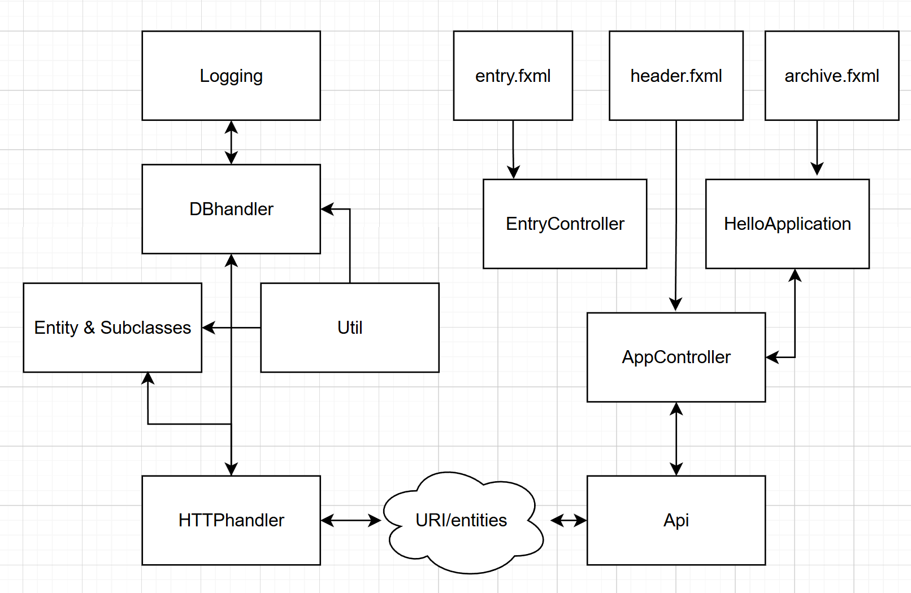

# What does it do?

"Schedule" is mainly a backend application that allows you to store several nodes in a tree-like structure.  
These nodes are different entities and must be subclasses of the `Entity` class.

The database and `DBhandler` class are type-agnostic, meaning they don't care what specific type you add.  
When performing any CRUD operation (adding, reading, updating, or deleting), the `Entity` you want to operate on must first be "rehydrated" (i.e., turned into a valid `Entity` object).

This approach keeps the database very strict: validation and legal behavior are fully encapsulated inside each `Entity` subclass.  
(`Entity` itself is abstract and cannot directly be stored.)

This structure makes it easy to add new classes in the future, each handling their own behavior.  
For this school project, I've only created one type, `"Project"`, but `DeletedEntity` and `Root` (UUID 0) are also implementations of `Entity`.

It would be very easy to add types like `CalendarEvent`, `LectureModule`, `GymTracking`, or `MultiTypeDataCollection` in the future. Type parameters are simply added as `{type: {typeName: {JsonArray}}}` on the frontend and parsed as you wish in `Entity.typeName`.  
(Just remember to add the type in `Entity.typeMap<String, Class<?>>`.)

Due to the backend's complexity, I chose not to focus heavily on the JavaFX part of the school assignment. I plan to continue developing this backend with more features and primarily use a WebGUI frontend for real-world use.

# Questions (part of school assignement)

I denne delen skal dere reflektere rundt egne valg, og vise forståelsen dere har for objektorientert programmering og pensum i emnet. Dere skal besvare følgende spørsmål:

1.  Hvilke deler av pensum i emnet dekkes i prosjektet, og på hvilken måte? (For eksempel bruk av arv, interface, delegering osv.)

This project encapsulates pretty much everything in the curriculum. The database handler is iterable, something that proved useful during testing.

I also implemented my own custom interfaces, for example using the Observer pattern for logging DB changes.

The main struct-like functions in the application are implementations of an abstract class (Entity), and this abstraction is used a lot throughout development of this project, and itself used as a validator for legal database entries.

The project is strongly encapsulated. The main method is literally just: 
`DB db = new DBhandler(true)`
`Logging log = new Logging(db)` 
`HTTPhandler.start(Util.Config.getIP(), Util.Config.getPort(), db)` 
inside a try-catch statement.

I'm using lambdas a lot, store local log files in Logging, and use FXML in the frontend.

I primarily did JUNIT unit tests for my DBhandler class. I didn't really need any more testing than that, as when DBhandler was implemented, everything just built on top of it.

2. Dersom deler av pensum ikke er dekket i prosjektet deres, hvordan kunne dere brukt disse delene av pensum i appen?

Absolutely. I got to get my hands dirty with Java JSON management. I found GSON from Google to be a really nice library for this. I also got to use HTTP through the Spark library, and of course had the database implementation using the SQLite library together with java.sql.

Lastly, I thought it would be fun to try implementing some multithreading. The Logging class actually performs most of its tasks on a separate worker thread. I thought this would be a really nice way to implement threading since the Logging class would be performing simple tasks I could easily abstract into Runnable functions. At that point, I just needed to put everything in a BlockingQueue<`Runnable`> and run them dynamically as new log items came in.

3. Hvordan forholder koden deres seg til Model-View-Controller-prinsippet? (Merk: det er ikke nødvendig at koden er helt perfekt i forhold til Model-View-Controller standarder. Det er mulig (og bra) å reflektere rundt svakheter i egen kode)

I'd say yes, to a certain point. If you encapsulate my backend as the Model and the View-Controller as the frontend, the answer is pretty much yes. But I did implement most of my frontend dynamic interaction directly in Controllers and not in their own classes. This is primarily because I wanted a quick frontend that worked on the backend I had already finalized, and I also underestimated a little how much logic I would need in the frontend.

If I were to do something like this again, I would definitely have stronger separation between displaying data, dynamically changing data, and parsing data for the screen / sending to API.

I would however exclaim that I'm not very happy about the gui code quality. This was really something I hacked together at the end, again because I plan to rebuild it in HTML/CSS/JS but with more feature-rich. I also need to do some cleanup in Backend which I will do, I mainly wanted to get a working MVP for this project.

4. Hvordan har dere gått frem når dere skulle teste appen deres, og hvorfor har dere valgt de testene dere har? Har dere testet alle deler av koden? Hvis ikke, hvordan har dere prioritert hvilke deler som skulle testes?

I knew going in that DBhandler "just working" would be very lucrative for the development of the rest of the project. It handles most of the heavy logic and is the baseline for what is allowed and not allowed. I knew reflection of JSON data to dynamically creating different classes based on that data would be very annoying to track down when dealing with JSON data sent from a client, handled by an API, parsed by HTTPhandler, and then constructed by DBhandler (I later moved the reflection function to Util). It was therefore important to me that when something wrong happened, I knew it wasn't in DBhandler, which I mostly managed to prevent (except for one small bug near the end :P).

I therefore chose to sink all of my tests into DBhandler, in which I made 9 JUnit tests simulating every legal and illegal action I could think of. I originally thought I was going to add unit tests for the other classes later, but DBhandler already handled so much of the logic so well that it didn't feel necessary for the rest of the backend.

Since the frontend basically just performs CRUD operations over HTTP and draws a filesystem-like nested GUI, there wasn't really anything to test there. If an entry isn't accepted, I get a 404 HTTP request and it would stack trace on the server. When making the frontend, the vast majority of the bugs I discovered were frontend issues, not backend ones. Even though a few sneaky ones managed to get through for a while.

# Diagram 

**Backend end the right, front end on the left**

---
**Everything beyond this point is general docs, not directly relevant to school assignment**
# Code Description (Backend)

First of all, 

The app's state is stored in a SQLite database. The [DBhandler](####`DBhandler`) class fully encapsulates management of this database. 

--- schema ---
### Table: Entities
  - `uuid` (INTEGER, PK)
  - `name` (TEXT)
  - `type` (TEXT)
  - `link` (TEXT)
  - `state` (TEXT)
  - `depth` (INT)
  - `children` (TEXT)
  - `dmp` (TEXT)

The database expect all entries to have this format. **IllegalStateException** is ran locally in **DBhandler** if this breach the database format. Most public **DBhandler** methods can return `null`. This means the method failed internally and no change was made. 

### Expected Database format:

- `uuid`,  *// generated by DBhander*
- `name` *// any String*
- `type` *// JsonObject as String:*
	- {
	- "`Project`":  *// More coming soon*
	- "{`doneBy`: `String (ISO8601 [YYYY-MM-DDTHH:MM:SS])`} *// JsonArray as String
	- } 
- `link` *// JsonArray as String:*
	- {"`key`":"`val`"} *<// String, String> accepts any reference including intra/internet links.*
- `state` *// String, accept any - limits/interaction handled by front end*
- `depth`  *// generated by DBhandler*
- `children`  *// nested entries by uuid seperated by ";", example: 11;39;58;90*
- `dmp`  *// meta-data, frontend agnostic. Utilized if you want creationDate, creationUser, etc*

Also note, you cannot fully delete anything in the database. delete(uuid) in DBhandler only soft-delete the entries. They're NOT recoverable, but still exist in database as Entity.DeletedEntity class.

If needed in the future, manual cleanup functions will be implemented. This is to keep the database fast and limit validation operations needed. If there are 200 entries in the database (inc. root), all items must have an unique UUID between, 0-199. The database does not need to be in numerical order to work, and custom sort functions can be implemented if you wish.

### Classes & Public Methods
#### `DBhandler` class
Implements `Iterable<Entity>`

#### Constructors
- `DBhandler(boolean isProd) throws SQLException` — *Initialize a handler (prod/test mode)*
- `Iterator<Entity> iterator()` — *Iterator with all entities in DB*
#### Observers
- `void addObserver(Logging.DBObserver observer)` — *Add an observer for database events*

#### CRUD Operations
- `Entity create(int parent_uuid, Entity newItem)` — *Create new entity with parent UUID*
- `Entity create(Entity parent, Entity newItem)` — *Create new entity with Entity & sync*
- `Entity create(Entity newItem)` — *Create new lowest level (parent=root) entity*
- `Entity read(int uuid)` — *Read an entity with dmp by UUID*
- `Entity read(int uuid, Boolean withDmp)` — *Read an entity with optional DMP*
- `Entity update(int uuid, Entity entry)` — *Update an entity*
- `Entity delete(int uuid, boolean recursive)` — *Delete an entity, optionally recursive*

#### Bulk Read Operations
- `List<Entity> readAll()` — *Read all entities*
- `JsonObject[] readAllAsJson()` — *Read all entities as JSON*
- `JsonObject readAsJson(int uuid)` — *Read a single entity as JSON*

#### Metadata and Utility
- `boolean dbContains(int uuid)` — *Check if UUID exists in database*
- `int size()` — *Count number of entries*
- `Entity[] createFromArray(Entity[] entities)` — *Bulk create from array*
- `String[] getAllDmp()` — *Retrieve all DMP metadata keys*

#### Maintenance
- `void cleanUpTest()` — *Clean up test database entries*

#### ToString Methods
- `String toStringWithoutDmp()` — *Stringify database without DMP metadata*
- `String toString()` — *Default toString (with DMP)*

---
#### `Entity` class & subclasses

#### Constructors
- `Entity(String name, String state, HashMap<String, String> link, HashMap<String, String> dmp)` — *Create a new Entity manually.*

#### Static Factory Methods
- `static Entity constructFromDB(HashMap<String, String> params, String name, HashMap<String, String> link, String state, int depth)` — *Construct an Entity from database fields.*

#### CRUD and Database Interaction
- `void replaceInDB(Entity newItem, DBhandler db) throws IllegalArgumentException` — *Replace this Entity in the database with a new version.*
- `void createChild(Entity child, DBhandler db) throws IllegalArgumentException` — *Create a new child Entity linked to this one.*
- `void sync(DBhandler db)` — *Synchronize this Entity with the latest database state.*

#### Getters
- `String getName()` — *Get the entity's name.*
- `String getState()` — *Get the entity's state.*
- `HashMap<String, String> getLink()` — *Get the entity's link map.*
- `String getChildren()` — *Get the entity's children field.*
- `int getDepth()` — *Get the entity's depth.*
- `int getUUID()` — *Get the entity's UUID.*
- `HashMap<String, String> getDmp()` — *Get the entity's DMP metadata.*

#### Setters
- `void setUUID(int uuid)` — *Set the entity's UUID. (Only locally in Entity, cannot affect DB)*
- `void setDepth(int depth)` — *Set the entity's depth.*
- `void setChildren(String children)` — *Set the entity's children field.*

#### Utility Methods
- `String parseType()` — *Parse and return the Entity's JSON structure.*
- `void clearDmp()` — *Clear all DMP metadata.*
- `String toStringWithoutDMP()` — *Get a string representation without DMP fields.*
- `String toString()` — *Full string representation including DMP.*

---
#### `HTTPhander` class 

#### Start
- `static void start(String ip, int port, DBhandler db)`

---
#### `Logging` class 
#### Constructors
-  `Logging(DBhandler db)`  — *initializing starts logging automatically*

#### Interface `DBObserver`
- `void onDBChanged(String action, String[] tablesThatHasChanged, String[] tablesNewValue)` — *handled by DBhandler, updates when DB changes*

---

#### `Util` class 

#### Static Nested Classes
- `class Config`

#### Config Methods
- `static String Config.getLogsPath()`

#### Entity Construction & Parsing
- `static JsonObject getDeletedEntityJson(int uuid, JsonObject dmp)`
- `static Entity jsonToEntity(JsonObject json)`

#### Example Data Generation
- `static String getDoneBy()`
- `static String getName()`
- `static HashMap<String, String> getLink()`
- `static String getState()`
- `static HashMap<String, String> getDmp()`
- `static Entity getExampleEntity()`

#### JSON and API Helpers
- `static HashMap<String, String> jsonObjectToHashMap(JsonObject jsonObject)`
- `static JsonObject packageJsonForAPI(JsonObject[] jsonArray)`
- `static JsonObject packageJsonForAPI(JsonObject json, int uuid)`
- `static JsonObject packageJsonForAPI(JsonObject json)`